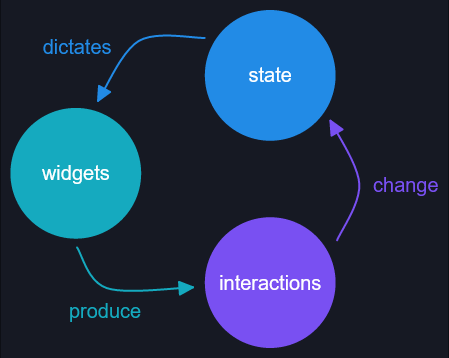

## Elm

之前在了解rust的ui时，碰巧了解到了[Elm](https://elm-lang.org/)，yew和iced都说参考了它，
而它也标榜自己是 `A delightful language for reliable web applications.`

昨天终于还是没有忍住，在空闲的时候看了看官方的文档，总的来说还是有一些感悟。先大概说下这个 Elm：
1. Elm是一门函数式语言，编译成javascript，所以和javascript有很好的可交互性，但是有严格的类型检查，避免运行时出错
2. Elm最终以DOM方式展现出来，所以css（例如Tailwind）什么的都是可以使用的，编程时也必须了解DOM才可以
3. Elm最重要的就是`Architecture`，将一个GUI程序主要分为
   - Model
   - View
   - Update

   Model 就是应用程序的状态数据，View就是展现出来的GUI，而Update就是根据用户的交互事件或内部事件来更新Model的。
   其中用户的交互事件是通过 `Message` 来完成，而内部事件是通过 `Subscription` 来完成。这个架构我特别喜欢，各部分
   分离得很好。例如：我们可以使用 `Model`/`Update`/`Message` 来进行单元测试，而不需要 `View`

`Elm`对我来说最不好的还是函数式编程，真的有那么一点不适应。`Immutable` 确实是有一点吸引力，但还不够^_^

## Iced

[iced](https://iced.rs) 和 `Elm` 的思想几乎是一样的，文档里的这张图画得很好

也就是说，我们不仅可以享受 `Elm` 架构的优越性，还可以利用rust的强大生态，简直不要太好了。
关键是还支持tokio的异步！这点比slint-ui要好，slint-ui不支持异步。
相比Tauri来说，[iced不打算支持mobile平台](https://github.com/iced-rs/iced/issues/302)，不过mobile平台确实挺难搞，
我觉得维护者是对的。
