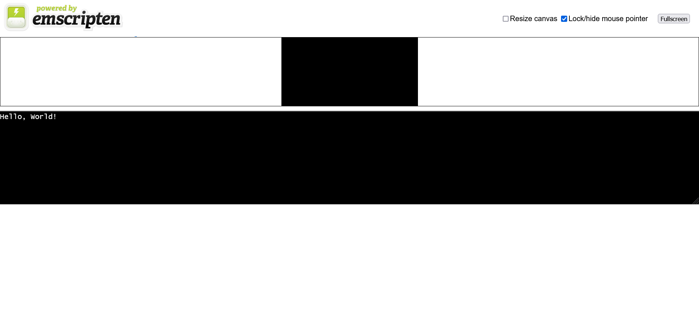

自从知道[occ的wasm](https://ocjs.org/)版本的存在，我就想试试wasm了，
这么多年的c++经验看看能不能在web时代继续发光发热。今天入个门！

## 安装 emscriptgen

参照 [官方文档](https://emscripten.org/docs/getting_started/downloads.html)，
连下载都很顺利

```shell
# Get the emsdk repo
git clone https://github.com/emscripten-core/emsdk.git

# Enter that directory
cd emsdk

# Fetch the latest version of the emsdk (not needed the first time you clone)
git pull

# Download and install the latest SDK tools.
./emsdk install latest

# Make the "latest" SDK "active" for the current user. (writes .emscripten file)
./emsdk activate latest

```

## 配置 Clion

Toolchains 选 Mingw，然后在 `CMake options`中添加

```text
-DCMAKE_TOOLCHAIN_FILE=<path to your emsdk>\upstream\emscripten\cmake\Modules\Platform\Emscripten.cmake
```
最后在 `CMakeLists.txt`中，添加

```CMakeLists.txt
set(CMAKE_EXECUTABLE_SUFFIX ".html") # 编译生成.html
```

然后啥也不用弄了，正常写点代码。

[官方文档](https://emscripten.org/docs/compiling/Building-Projects.html?highlight=cmake)
说是要用emcmake/emmake，不太好弄，最后[这里](https://stackoverflow.com/questions/51868832/integrate-emscripten-in-clion/72578219#72578219)给出了答案

## 查看 Hello world 的输出

Clion打开生成的html文件，然后右上角选择一个浏览器就可以了，Clion自己会创建临时的server

